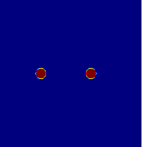

# Fungal_Interactions
A partial differential equation (PDE) model simulating a single or two fungal competitors in a two-dimensional space, to mechanistically explain the observed change of fungal competition under heat stress.

The model was published in OIKOS: https://nsojournals.onlinelibrary.wiley.com/doi/full/10.1111/oik.09377

Under a changing climate, soil fungal communities will increasingly be subject to periods of heat. These periods can affect the performance of individual fungi and their competition for space and resources. Competition between fungi is strongly controlled by the exudation of inhibitory compounds, resulting in different competitive outcomes that range from overgrowth of the inferior competitor to a deadlock, where the competing fungi inhibit each other. As heat stress can alter the competitive outcome between fungi, the community composition can also change strongly. So far, a general understanding of the mechanisms that drive the competitive outcome between fungi under heat stress is still missing. 

This model describes mycelial growth, the production and secretion of antifungal compounds and the synthesis of heat shock proteins of interacting colonies. We found a heat stress-induced lag phase favouring the accumulation of antifungal compounds and the build-up of inhibitor fields. This led to a qualitative change of the competitive outcome, reducing the occurrence of overgrowth by two thirds. The changes in competitive outcome favoured slower growing species, which benefit more strongly from the additional time during a stress-induced lag to build up a defence or block territory that would otherwise be quickly claimed by faster competitors.

Our work is an important step towards understanding how environmental changes may lead to qualitative changes in competitive outcomes. Our results show the importance of explicitly including species interactions into studies of climate change effects.
